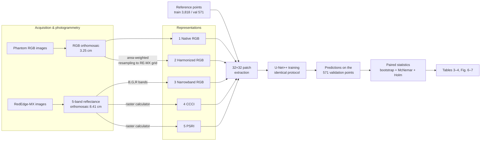
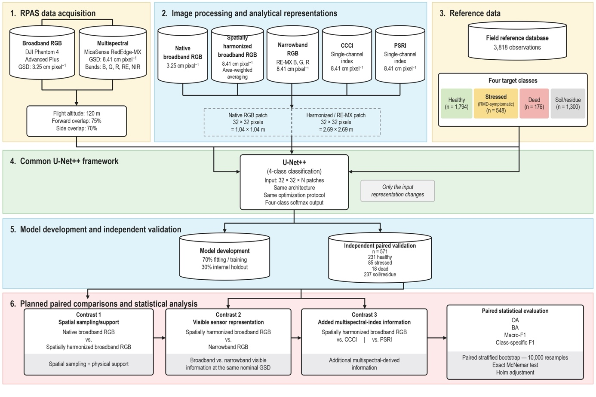

# Reproduction guide

This site explains how to **reproduce** the experiment in

> *Spatial–spectral trade-offs in RPAS-based phytosanitary classification of* Eucalyptus saligna
> — da Silva, Richter, Borges Junior, Amado, Amaral & Eugenio.

It does not summarise or discuss the paper. It covers **what to run, in which order, with which parameters, and what outputs to expect**, so you can rebuild every number in the paper's results tables from raw RPAS imagery and reference points.

!!! abstract "The experiment in one paragraph"
    One **U-Net++ patch classifier** is trained separately on **five image representations** of the same stand. Each observation is a **32 × 32 pixel patch** centred on a reference point and labelled with one of **four classes**: stressed (RMD), dead, healthy or soil/residue. Nothing changes between models except the input channels. All five models are scored on the **same 571 validation observations**, and each alternative is compared with **spatially harmonized broadband RGB**. The comparisons use paired, class-stratified bootstrap confidence intervals and exact McNemar tests with Holm correction.

## What you will reproduce

| # | Representation | Source sensor | Channels | GSD (cm px⁻¹) | Patch footprint | Code folder |
|---|---|---|---|---|---|---|
| 1 | Broadband RGB — **native** | Phantom 4 Adv+ RGB camera | 3 | 3.25 | 1.04 × 1.04 m | `linux/rgb_drone` |
| 2 | Broadband RGB — **harmonized** (reference) | Phantom 4 Adv+ RGB camera | 3 | 8.41 | 2.69 × 2.69 m | `linux/rgb_degradado` |
| 3 | **Narrowband RGB** | MicaSense RedEdge-MX (B, G, R) | 3 | 8.41 | 2.69 × 2.69 m | `linux/rgb_micasense` |
| 4 | **CCCI** | MicaSense RedEdge-MX | 1 | 8.41 | 2.69 × 2.69 m | `linux/IVs` |
| 5 | **PSRI** | MicaSense RedEdge-MX | 1 | 8.41 | 2.69 × 2.69 m | `linux/IVs` |

The three pre-specified contrasts, each against harmonized RGB (#2):

1. **Spatial sampling/support:** native RGB (#1) vs harmonized RGB (#2)
2. **Visible sensor representation at matched GSD:** narrowband RGB (#3) vs harmonized RGB (#2)
3. **Added multispectral-index information:** CCCI (#4) and PSRI (#5) vs harmonized RGB (#2)

## End-to-end pipeline

{ loading=lazy }
/// caption
Workflow of the comparison framework (paper, Fig. 5).
///

## How this site is organised

- :material-rocket-launch: **[Getting started](getting-started/index.md)**
  Software environment, the input data you need, and a one-page run order.

- :material-pipe: **[Pipeline](pipeline/index.md)**
  Nine steps from orthomosaics to the paired statistics, with the exact parameters and commands for each.

- :material-book-open-variant: **[Reference](reference/index.md)**
  Script catalogue, configuration keys, file formats, a Portuguese → English glossary and a list of every **paper-vs-code difference** with the patch that fixes it.

- :material-puzzle: **[Extras](extras/index.md)**
  Scripts in the repository that the paper does not use: RGB vegetation indices, wall-to-wall mapping and XAI.

!!! warning "Before you start: read *Paper vs. code*"
    The published method is the reference for this guide. A few details of the paper are **not implemented** in the scripts as delivered (stratified split for RGB, class oversampling, the 16-test Holm family). Each one is marked where it matters, and [Paper vs. code](reference/paper-vs-code.md) collects them all with patches.

!!! tip "Quick check without any imagery"
    The five per-observation prediction files used in the paper are included in `linux/comparacao/`. Running the statistics script on them reproduces Tables 3 and 4 in a few minutes. See [Expected results](pipeline/09-expected-results.md#verify-the-statistics-with-the-shipped-predictions).
