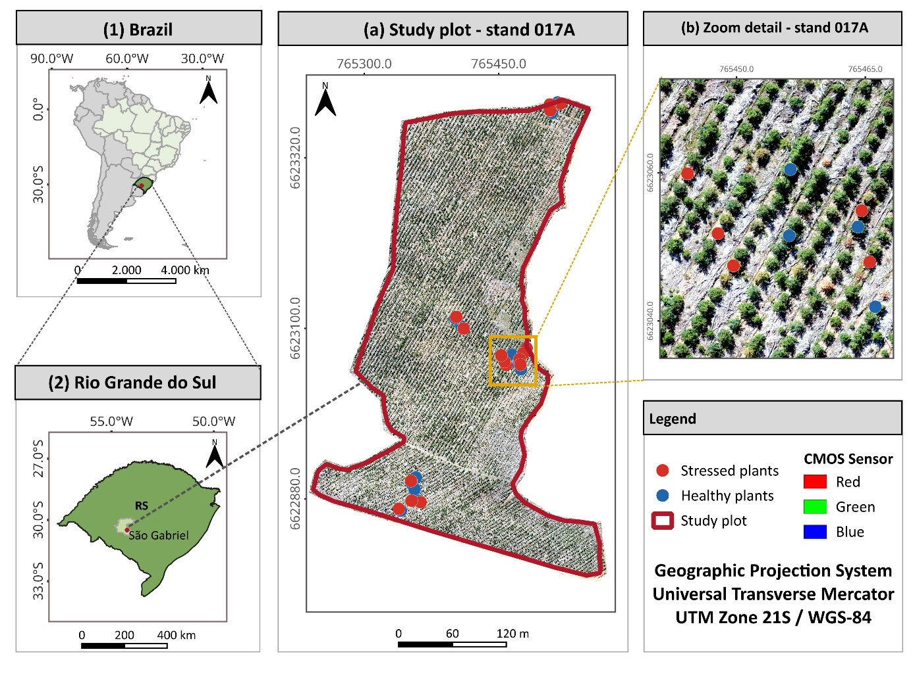

# 1 · Imagery and preprocessing

This step produces the two orthomosaics that every later step reads. It is done outside the Python code.

## Acquisition parameters

| Parameter | RedEdge-MX (multispectral) | Phantom 4 Advanced Plus (RGB) |
|---|---|---|
| Date / time | 30 Apr 2025, 13:00–14:00 (UTC−3), clear sky | same flight campaign |
| Platform | DJI Phantom 4 Advanced Plus | integrated 20 MP CMOS camera, mechanical shutter |
| Flight planning | Precision Flight v2.4.2 | — |
| Altitude AGL | 120 m | — |
| Speed | 10 m s⁻¹ | — |
| Overlap (side / forward) | 70 % / 75 % | — |
| Bands | 475 (B), 560 (G), 668 (R), 717 (RE), 840 (NIR) nm, 12-bit | broadband R, G, B |
| Radiometry | DLS2 irradiance + manufacturer reflectance panel | none |
| Resulting GSD | **8.41 cm px⁻¹** | **3.25 cm px⁻¹** |

Study site: stand 017A, Vacacaí Forest Project (CMPC Brasil), São Gabriel, RS, Brazil. It is about 11 ha of one *E. saligna* clone planted in late October 2024 at 2.14 × 3.5 m spacing, and it was about six months old at acquisition.

{ loading=lazy width="600" }

## Photogrammetry (Agisoft Metashape 2.2.1)

Process both datasets with the **same workflow and the same ground control points (GCPs)** so that the two orthomosaics are co-registered.

1. Align photos with accuracy **High**.
2. Build the sparse cloud from tie points and refine exterior orientation by automatic aerial triangulation.
3. Import the GCPs and optimise cameras.
4. Build the dense point cloud and then the DSM.
5. Build the orthomosaic.
6. **Multispectral only:** calibrate reflectance using the reflectance panel **and** the DLS2 sun sensor, before step 5.
7. Export GeoTIFFs in **WGS 84 / UTM 21S (EPSG:32721)**:
    - RGB: one 3-band orthomosaic at native 3.25 cm;
    - RedEdge-MX: five single-band reflectance rasters (B, G, R, RE, NIR) on **one common grid** at 8.41 cm.

!!! check "Acceptance checks before continuing"
    - All five RedEdge-MX rasters have **identical** width, height and transform. The harmonization step copies this grid, and the index maps inherit it.
    - `gdalinfo` of a RedEdge-MX band reports a pixel size of **0.0841 m**. `harmonize_rgb_to_rededge_explicit.py` aborts if it differs from 0.0841 by more than 1 × 10⁻⁴ m.
    - RGB and RedEdge-MX mosaics overlay without visible shifts in QGIS; check a few crowns.
