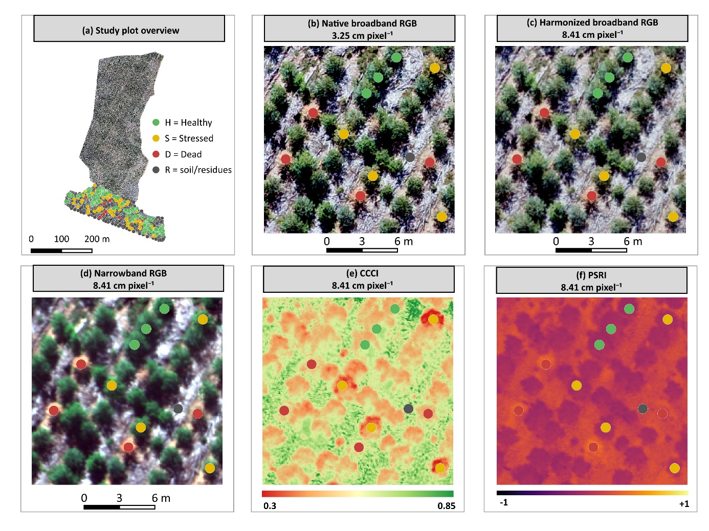
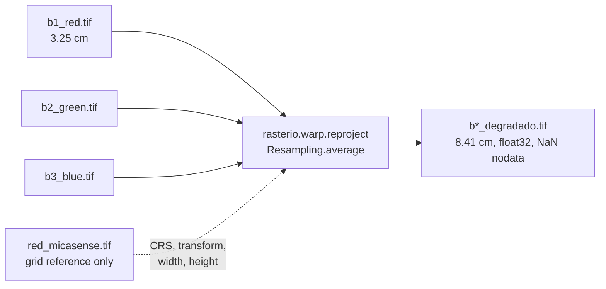

# 2 · Building the five representations

{ loading=lazy }
/// caption
The same ground area in the five representations (paper, Fig. 4).
///

## Native broadband RGB

The Phantom orthomosaic stays at its native 3.25 cm. The code expects **one GeoTIFF per band**:

```bash
cd linux/rgb_drone
gdal_translate -b 1 rgb_orthomosaic.tif b1_red.tif
gdal_translate -b 2 rgb_orthomosaic.tif b2_green.tif
gdal_translate -b 3 rgb_orthomosaic.tif b3_blue.tif
```

Leave the data type unchanged (8- or 16-bit). The extraction step reads values as `float32` and applies a percentile stretch fitted on this raster ([step 4](04-patch-extraction.md#normalisation-rgb-like-inputs)).

## Spatially harmonized broadband RGB

**Script:** `linux/rgb_degradado/harmonize_rgb_to_rededge_explicit.py`

Each native RGB band is resampled onto the **exact** RedEdge-MX grid by **area-weighted averaging**. The multispectral raster is used **only for geometry**: CRS, transform (pixel size, origin, alignment), width, height and extent. No spectral information is transferred.



1. Edit the constants at the top of the script. The paths are absolute and point to the original author's machine.

    ```python
    RGB_BANDS = {
        "R": "/path/to/rgb_drone/b1_red.tif",
        "G": "/path/to/rgb_drone/b2_green.tif",
        "B": "/path/to/rgb_drone/b3_blue.tif",
    }
    MULTISPECTRAL_REFERENCE_PATH = "/path/to/rgb_micasense/b1_red.tif"  # any co-registered RE-MX band
    OUTPUT_DIR = Path("/path/to/rgb_degradado")
    EXPECTED_GSD_METERS = 0.0841    # abort if the reference grid differs (tolerance 1e-4 m)
    ```

2. Run the script:

    ```bash
    python harmonize_rgb_to_rededge_explicit.py
    ```

3. The script audits its own output and raises an error unless each output band has **the same CRS, transform, width and height** as the reference, and the three outputs share one grid.

Core operation, per band:

```python
dst = np.full((ref.height, ref.width), np.nan, dtype=np.float32)
reproject(
    source=rasterio.band(src, 1), destination=dst,
    src_transform=src.transform, src_crs=src.crs, src_nodata=src.nodata,
    dst_transform=ref.transform, dst_crs=ref.crs, dst_nodata=np.nan,
    resampling=Resampling.average,
)
# written as float32 GeoTIFF, nodata=NaN, deflate + predictor 3
```

!!! info "What harmonization does *not* do"
    No sharpening, synthetic blur, spectral transformation or simulation of the RedEdge-MX spectral response functions. The product is **spatially harmonized broadband RGB**, not "simulated multispectral RGB".

The outputs `b1_red_degradado.tif`, `b2_green_degradado.tif` and `b3_blue_degradado.tif` must sit next to `linux/rgb_degradado/config.yml`, which references them by those names.

## Narrowband RGB

This representation uses the three **visible** RedEdge-MX bands only, without red edge or NIR. Place them in `linux/rgb_micasense/` as:

| File | RedEdge-MX band |
|---|---|
| `b1_red.tif` | Red, 668 nm |
| `b2_green.tif` | Green, 560 nm |
| `b3_blue.tif` | Blue, 475 nm |

No stacking step is needed: the extraction script reads the three files and stacks them in `[R, G, B]` order for each patch.

## CCCI and PSRI { #cccipsri }

Both indices are computed from the RedEdge-MX reflectance bands in the **QGIS raster calculator** and then clipped to the stand boundary.

### Formulas

Canopy Chlorophyll Content Index (Barnes et al. 2000):

\[
\mathrm{CCCI}=\frac{\dfrac{R_{NIR}-R_{RE}}{R_{NIR}+R_{RE}}}{\dfrac{R_{NIR}-R_{R}}{R_{NIR}+R_{R}}}
\]

Plant Senescing Reflectance Index, in the form used in the paper (after Merzlyak et al. 1999):

\[
\mathrm{PSRI}=\frac{R_{R}-R_{G}}{R_{RE}}
\]

where \(R_G, R_R, R_{RE}, R_{NIR}\) are green, red, red-edge and NIR reflectance.

### QGIS procedure

1. Load the five RedEdge-MX reflectance rasters. The layer names below assume `green`, `red`, `rededge` and `nir`.
2. **Raster ▸ Raster Calculator**, output format GeoTIFF, output type `Float32`, with the grid taken from one of the bands:

    === "CCCI"

        ```text
        (("nir@1" - "rededge@1") / ("nir@1" + "rededge@1"))
          / (("nir@1" - "red@1") / ("nir@1" + "red@1"))
        ```

    === "PSRI"

        ```text
        ("red@1" - "green@1") / "rededge@1"
        ```

3. **Raster ▸ Extraction ▸ Clip Raster by Mask Layer**, with mask layer `dados/limite_area.shp`, *Keep resolution of input raster* checked and a nodata value assigned. Save the results as `CCCI_recortado.tif` and `PSRI_recortado.tif` (*recortado* = clipped).
4. Copy both files into `linux/IVs/`.

??? example "Equivalent Python (rasterio), for scripted reproduction"
    ```python
    import numpy as np, rasterio
    from rasterio.mask import mask
    import geopandas as gpd

    def read(p):
        with rasterio.open(p) as s:
            return s.read(1, masked=True).astype("float32").filled(np.nan), s.profile

    G, prof = read("green.tif"); R, _ = read("red.tif")
    RE, _ = read("rededge.tif"); NIR, _ = read("nir.tif")

    with np.errstate(divide="ignore", invalid="ignore"):
        ccci = ((NIR - RE) / (NIR + RE)) / ((NIR - R) / (NIR + R))
        psri = (R - G) / RE
    prof.update(dtype="float32", count=1, nodata=np.nan)

    shapes = gpd.read_file("dados/limite_area.shp").to_crs(prof["crs"]).geometry
    for name, arr in {"CCCI": ccci, "PSRI": psri}.items():
        arr[~np.isfinite(arr)] = np.nan
        with rasterio.open(f"{name}_tmp.tif", "w", **prof) as d:
            d.write(arr, 1)
        with rasterio.open(f"{name}_tmp.tif") as s:
            out, tr = mask(s, shapes, crop=True, nodata=np.nan)
            p = s.profile; p.update(transform=tr, height=out.shape[1], width=out.shape[2])
        with rasterio.open(f"{name}_recortado.tif", "w", **p) as d:
            d.write(out)
    ```

!!! note "Index values are fed to the network raw"
    The index pipeline applies **no normalisation**: patches contain the raw CCCI/PSRI values. RGB inputs are percentile-stretched. See [step 4](04-patch-extraction.md).

## Spatial support of a 32 × 32 patch

\[
32 \times 3.25\ \text{cm} = 1.04\ \text{m} \qquad\qquad 32 \times 8.41\ \text{cm} = 2.69\ \text{m}
\]

The patch size is fixed in pixels, so harmonization changes **both** the spatial sampling and the ground area (context) the network sees. The native-vs-harmonized contrast is therefore a joint *spatial-sampling/support* contrast, not a pure GSD effect.
