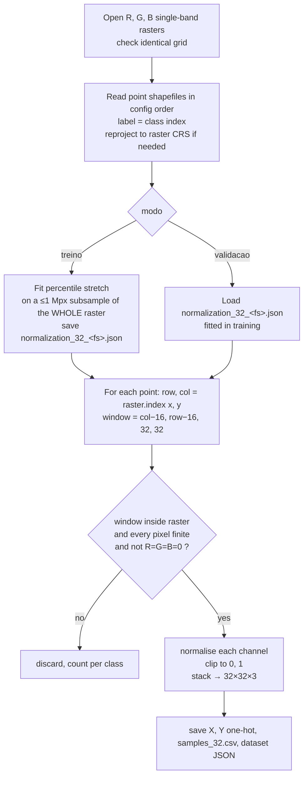

# 4 · Patch extraction

Every reference point becomes one tensor of shape **32 × 32 × C**, centred on the point.

| Representation | Script | Channels (order) | Normalisation |
|---|---|---|---|
| Native RGB | `rgb_drone/1_extract_train_data_from_points.py` | R, G, B | percentile 2–98 stretch |
| Harmonized RGB | `rgb_degradado/1_extract_train_data_from_points.py` | R, G, B | percentile 2–98 stretch |
| Narrowband RGB | `rgb_micasense/1_extract_train_data_from_points.py` | R, G, B | percentile 2–98 stretch |
| CCCI / PSRI | `IVs/1_extract_multi_com_id.py` | index | **none** (raw values) |

Each script runs **twice**: first with `modo: treino` (training points), then with `modo: validacao` (validation points).

## Algorithm (RGB-like inputs)



### Centring convention

```python
row, col = src.index(x, y)          # pixel containing the point
half = 32 // 2
Window(col - half, row - half, 32, 32)
```

The point falls in pixel (16, 16) of the patch, just below and right of the geometric centre, because the size is even.

### Normalisation (RGB-like inputs)

Fitted **once, in training mode**, on the whole raster rather than only the patches (`bands_indices.ajustar_normalizacao`):

1. Read each band decimated to at most `max_pixels_amostra = 1,000,000` pixels (nearest-neighbour).
2. Keep pixels where all three bands are finite and not all zero.
3. For each channel \(k\), compute \(p_{2,k}\) and \(p_{98,k}\).
4. Transform every patch value:

\[
x'_k = \operatorname{clip}\!\left(\frac{x_k - p_{2,k}}{p_{98,k}-p_{2,k}},\,0,\,1\right)
\]

The parameters are saved to `context_models/<feature_set>/normalization_32_<feature_set>.json`, and validation extraction **reuses** them. Each representation gets its own parameters, fitted on its own raster.

!!! warning "Run training mode first"
    In `modo: validacao` the script raises `FileNotFoundError` if the training normalisation JSON does not exist.

### Which points are discarded

| Rule | RGB-like scripts | Index script |
|---|---|---|
| Geometry not a `Point` or empty | skipped | skipped (counted) |
| Window crosses the raster edge | discarded | read `boundless`, then discarded as NaN |
| Any pixel NaN / nodata | discarded | discarded |
| Any pixel with R = G = B = 0 | discarded | n/a |

Discards per class are stored in `dataset_32_<fs>.json → discarded_by_class` and printed to the console.

## Algorithm (CCCI / PSRI)

`IVs/1_extract_multi_com_id.py` loops over the rasters listed in `imagens:` (`CCCI_recortado`, `PSRI_recortado`). For each point it reads the 32 × 32 window with `boundless=True, masked=True`, converts nodata to NaN, rejects any patch that is not fully finite, and appends a channel axis (`32×32×1`). The **sample_id** is written together with the metadata.

## Outputs

Written to `context_data/` (training) or `context_data_validation/` (validation):

| File | Content |
|---|---|
| `X_context_32_<fs>.npy` | `float32`, shape `(n, 32, 32, C)` |
| `Y_labels_32_<fs>.npy` | `float32` one-hot, shape `(n, 4)` |
| `samples_32.csv` (RGB) / `samples_32_<raster>.csv` (indices) | one row per sample, **same order as X**: `classe, label, fid, x, y` (+ `sample_id, raster` for indices) |
| `dataset_32_<fs>.json` (RGB only) | channel names, class names, n, discards |
| `context_models/<fs>/normalization_32_<fs>.json` (RGB, training only) | percentile parameters |

`<fs>` is the feature-set name: `rgb` (native and harmonized), `ms_rgb` (narrowband), `CCCI_recortado` or `PSRI_recortado`.

!!! check "Expected validation shapes"
    - Native RGB: `X_context_32_rgb.npy` → `(589, 32, 32, 3)`
    - Harmonized RGB: `(571, 32, 32, 3)`; narrowband RGB `X_context_32_ms_rgb.npy` → `(571, 32, 32, 3)`
    - `X_context_32_CCCI_recortado.npy` and `..._PSRI_recortado.npy` → `(571, 32, 32, 1)`
