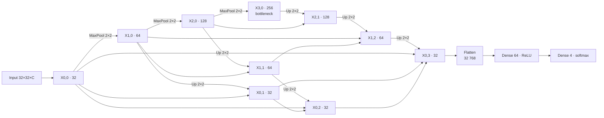

# 5 · U-Net++ classifier

A U-Net++ (Zhou et al. 2019) encoder with nested decoder, used as a **multiscale feature extractor for patch-level classification**. It does not produce a segmentation map: the finest decoder node is flattened and fed to a dense softmax head that outputs one 4-class probability vector per patch.

The same function, `unetpp_classifier_model`, appears in `rgb_*/2_train.py` and `IVs/2_train_multi_controlado.py`. The code is identical; only the input channel count `C` differs.

## Building block

```python
def conv_block(x, filters, dropout_rate=0.2):
    x = Conv2D(filters, (3, 3), padding="same", activation="relu")(x)
    x = BatchNormalization()(x)
    x = Dropout(dropout_rate)(x)
    x = Conv2D(filters, (3, 3), padding="same", activation="relu")(x)
    x = BatchNormalization()(x)
    return x
```

Each block is Conv 3×3 + ReLU → BN → Dropout 0.2 → Conv 3×3 + ReLU → BN.

## Topology



## Layer table

| Node | Inputs (concatenated) | In channels | Filters | Spatial size |
|---|---|---|---|---|
| X0,0 | input | C | 32 | 32 × 32 |
| X1,0 | MaxPool(X0,0) | 32 | 64 | 16 × 16 |
| X2,0 | MaxPool(X1,0) | 64 | 128 | 8 × 8 |
| X3,0 | MaxPool(X2,0) | 128 | 256 | 4 × 4 |
| X0,1 | Up(X1,0), X0,0 | 96 | 32 | 32 × 32 |
| X1,1 | Up(X2,0), X1,0 | 192 | 64 | 16 × 16 |
| X2,1 | Up(X3,0), X2,0 | 384 | 128 | 8 × 8 |
| X0,2 | Up(X1,1), X0,0, X0,1 | 128 | 32 | 32 × 32 |
| X1,2 | Up(X2,1), X1,0, X1,1 | 256 | 64 | 16 × 16 |
| X0,3 | Up(X1,2), X0,0, X0,1, X0,2 | 160 | 32 | 32 × 32 |
| Head | Flatten(X0,3) → Dense(64, ReLU) → Dense(4, softmax) | 32,768 | — | — |

"Up" is `UpSampling2D((2, 2))`, nearest-neighbour. Use `padding="same"` everywhere.

**Parameter count:** 4,336,932 total for C = 3 (4,333,604 trainable) and 4,336,356 for C = 1. Almost half of that (2,097,476) is the Flatten → Dense(64) layer.

!!! note "Input size constraint"
    Three 2 × 2 poolings require the patch side to be divisible by 8. The RGB extraction scripts enforce this; 32 satisfies it.

!!! info "Figure 3 in the paper"
    The paper's architecture figure draws an extra node, X1,3. The implementation used for every result has **no** X1,3: the head reads X0,3 only, exactly as in the table above.
