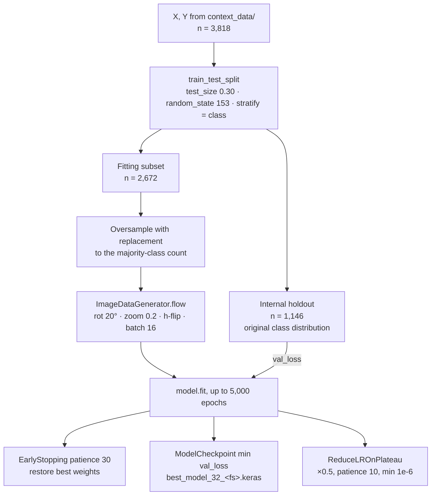

# 6 · Training protocol

**Scripts:** `rgb_drone/2_train.py`, `rgb_degradado/2_train.py`, `rgb_micasense/2_train.py`, `IVs/2_train_multi_controlado.py`

Each script loads `context_data/X_context_32_<fs>.npy` and `Y_labels_32_<fs>.npy` for every feature set in the config, and trains one model per feature set.

## Procedure



## Hyperparameters

| Parameter | Value | Config key |
|---|---|---|
| Random seed (NumPy, TF, `random`, split) | 153 | `random_seed` |
| Holdout fraction | 0.30, stratified | `training.test_size` |
| Optimiser | Adam | — |
| Initial learning rate | 1 × 10⁻⁴ | `training.learning_rate` |
| Loss | categorical cross-entropy | — |
| Batch size | 16 | `training.batch_size` |
| Max epochs | 5,000 | `training.epochs` |
| Monitor | `val_loss` (mode `min`) | `training.monitor` |
| Early-stopping patience | 30 epochs, `restore_best_weights=True` | `training.patience` |
| ReduceLROnPlateau | factor 0.5, patience 10, `min_lr` 1 × 10⁻⁶ | hard-coded |
| Augmentation | `rotation_range=20`, `zoom_range=0.2`, `horizontal_flip=True` | `training.augment` |
| Class balancing | random oversampling with replacement of the fitting subset | patch P2 |

Augmentation uses Keras defaults (`fill_mode="nearest"`, no vertical flip) and is applied **only** to the fitting batches, never to the holdout.

## Required patches (paper conformity)

The delivered scripts differ from the published protocol in three points. Apply these edits to **all four** training scripts, using the same code in each, so the models stay comparable.

### P1 · Stratified split (RGB scripts)

`IVs/2_train_multi_controlado.py` already stratifies. The three `rgb_*/2_train.py` do not:

```python title="rgb_*/2_train.py"
X_train, X_test, Y_train, Y_test = train_test_split(
    X, Y, test_size=test_size_, random_state=seed_value,
    stratify=np.argmax(Y, axis=1),          # ← add
)
```

### P2 · Oversample the fitting subset

No delivered script balances classes. The paper states that oversampling with replacement is applied **only to the fitting subset**. The holdout keeps its original distribution. The paper does not give the target count; this guide uses the **majority-class count** of the fitting subset.

```python title="add to every training script, after the split"
def oversample_with_replacement(X, Y, seed):
    """Balance classes by resampling minority classes with replacement."""
    rng = np.random.default_rng(seed)
    y = np.argmax(Y, axis=1)
    n_max = np.bincount(y).max()
    idx = []
    for c in np.unique(y):
        c_idx = np.flatnonzero(y == c)
        extra = rng.choice(c_idx, size=n_max - c_idx.size, replace=True)
        idx.append(np.concatenate([c_idx, extra]))
    idx = np.concatenate(idx)
    rng.shuffle(idx)
    return X[idx], Y[idx]

X_train, Y_train = oversample_with_replacement(X_train, Y_train, seed_value)  # not X_test!
```

With the paper's 2,672 fitting observations (≈1,256 healthy, 384 stressed, 123 dead and 910 soil after the stratified split), balancing gives about 4 × 1,256 ≈ 5,024 samples per epoch.

### P3 · Seeded augmentation stream (RGB scripts)

```python title="rgb_*/2_train.py"
history = model.fit(
    datagen.flow(X_train, Y_train, batch_size=batch_size, seed=seed_value),  # ← seed
    ...
)
```

## Running

```bash
cd linux/rgb_degradado        # or rgb_drone, rgb_micasense
python 2_train.py

cd linux/IVs
python 2_train_multi_controlado.py            # --config config_multi_controlado.yml (default)
```

!!! warning "`rgb_drone` trains two models by default"
    `rgb_drone/config.yml` has `feature_sets.executar: [rgb, ivs]`. For the paper, only `rgb` is needed. Set `executar: [rgb]`, or ignore the `ivs` model ([Extras](../extras/rgb-indices.md)).

## Outputs

| Path | Content |
|---|---|
| `context_models/<fs>/best_model_32_<fs>.keras` | lowest-`val_loss` model, **used for all predictions** |
| `logs/<fs>/` (`logs/<fs>_controlado/` for indices) | TensorBoard logs |
| `resultados/<fs>/historico_treinamento_<fs>.xlsx` | per-epoch loss, accuracy, lr (`resultados_controlados/` for indices) |
| `resultados/<fs>/loss_<fs>.png`, `accuracy_<fs>.png` | learning curves |

At the end the console prints loss and accuracy on the internal holdout. These are **not** the paper's reported metrics, which all come from the 571-observation validation set.
