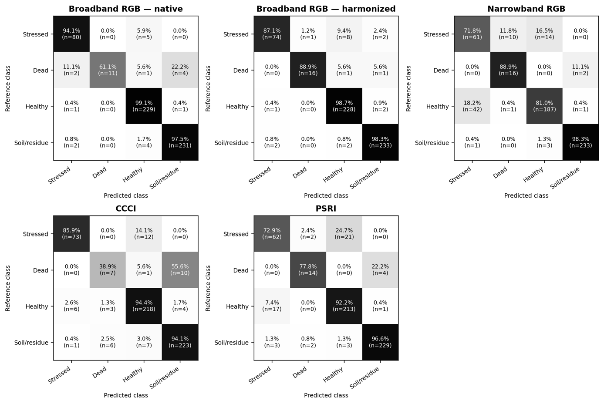

# 9 · Expected results

Use this page as the acceptance test for a reproduction. The numbers below are the paper's values. Running step 8 on the prediction CSVs shipped in `linux/comparacao/` reproduces them exactly.

## Sample sizes

| Check | Expected |
|---|---|
| Validation patches at 8.41 cm (harmonized RGB, narrowband RGB, CCCI, PSRI) | 571: 85 stressed, 18 dead, 231 healthy, 237 soil/residue |
| Validation patches at 3.25 cm (native RGB) | 589: 86 / 18 / 232 / 253 |
| Pairs per comparison (`n_pareado`) | 571 |
| Pairing method, native RGB | `espacial_tol_0.01`, max distance ≈ 0.5 mm |
| Pairing method, other three | `sample_id` |

## Table 3: performance on the paired validation set (n = 571)

| Representation | OA | BA | Macro-F1 | F1 stressed | F1 dead | F1 healthy |
|---|---|---|---|---|---|---|
| Broadband RGB, native | 0.965 | 0.880 | 0.913 | 0.941 | 0.759 | 0.974 |
| Broadband RGB, harmonized | **0.965** | **0.932** | **0.945** | 0.914 | **0.914** | 0.970 |
| Narrowband RGB | 0.870 | 0.850 | 0.800 | 0.646 | 0.711 | 0.860 |
| CCCI | 0.912 | 0.783 | 0.792 | 0.885 | 0.412 | 0.930 |
| PSRI | 0.907 | 0.849 | 0.851 | 0.743 | 0.778 | 0.910 |

Supplementary metrics computed from the same CSVs:

| Representation | Weighted-F1 | F1 soil/residue | Precision (S / D / H / Soil) | Recall (S / D / H / Soil) |
|---|---|---|---|---|
| Harmonized RGB | 0.965 | 0.981 | 0.961 / 0.941 / 0.954 / 0.979 | 0.871 / 0.889 / 0.987 / 0.983 |
| Narrowband RGB | 0.875 | 0.985 | 0.587 / 0.593 / 0.917 / 0.987 | 0.718 / 0.889 / 0.810 / 0.983 |
| CCCI | 0.911 | 0.941 | 0.912 / 0.438 / 0.916 / 0.941 | 0.859 / 0.389 / 0.944 / 0.941 |
| PSRI | 0.907 | 0.972 | 0.756 / 0.778 / 0.899 / 0.979 | 0.729 / 0.778 / 0.922 / 0.966 |

## Confusion matrices (rows = true class, counts)

Order: stressed, dead, healthy, soil/residue.

=== "Harmonized RGB"

    |  | S | D | H | Soil |
    |---|---|---|---|---|
    | **S** (85) | 74 | 1 | 8 | 2 |
    | **D** (18) | 0 | 16 | 1 | 1 |
    | **H** (231) | 1 | 0 | 228 | 2 |
    | **Soil** (237) | 2 | 0 | 2 | 233 |

=== "Narrowband RGB"

    |  | S | D | H | Soil |
    |---|---|---|---|---|
    | **S** (85) | 61 | 10 | 14 | 0 |
    | **D** (18) | 0 | 16 | 0 | 2 |
    | **H** (231) | 42 | 1 | 187 | 1 |
    | **Soil** (237) | 1 | 0 | 3 | 233 |

=== "CCCI"

    |  | S | D | H | Soil |
    |---|---|---|---|---|
    | **S** (85) | 73 | 0 | 12 | 0 |
    | **D** (18) | 0 | 7 | 1 | 10 |
    | **H** (231) | 6 | 3 | 218 | 4 |
    | **Soil** (237) | 1 | 6 | 7 | 223 |

=== "PSRI"

    |  | S | D | H | Soil |
    |---|---|---|---|---|
    | **S** (85) | 62 | 2 | 21 | 0 |
    | **D** (18) | 0 | 14 | 0 | 4 |
    | **H** (231) | 17 | 0 | 213 | 1 |
    | **Soil** (237) | 3 | 2 | 3 | 229 |

=== "Native RGB (all 589)"

    |  | S | D | H | Soil |
    |---|---|---|---|---|
    | **S** (86) | 81 | 0 | 5 | 0 |
    | **D** (18) | 2 | 11 | 1 | 4 |
    | **H** (232) | 1 | 0 | 230 | 1 |
    | **Soil** (253) | 2 | 0 | 4 | 247 |

    These counts include the 18 native-only observations. The paired 571 are a subset.

Key row-normalised values quoted in the paper: narrowband RGB puts **16.5 %** of stressed trees in healthy and **18.2 %** of healthy trees in stressed; CCCI gets **38.9 %** of dead trees right and assigns **55.6 %** to soil/residue; PSRI puts **24.7 %** of stressed trees in healthy.

{ loading=lazy }
/// caption
True-class-normalised confusion matrices (paper, Fig. 6).
///

## Table 4: paired contrasts vs harmonized RGB

Δ = alternative − harmonized RGB, with the 95 % percentile CI from 10,000 paired class-stratified bootstrap replicates (seed 153).

| Alternative | ΔOA | ΔBA | ΔMacro-F1 | ΔF1 stressed | Global McNemar *b* vs *c* | Holm p |
|---|---|---|---|---|---|---|
| Native RGB | 0.000 (−0.014, 0.014) | −0.053 (−0.108, −0.002) | −0.032 (−0.084, 0.009) | +0.028 (−0.004, 0.065) | 9 vs 9 | 1.000 |
| Narrowband RGB | −0.095 (−0.123, −0.068) | −0.083 (−0.133, −0.033) | −0.144 (−0.192, −0.097) | −0.268 (−0.354, −0.184) | 63 vs 9 | < 0.001 |
| CCCI | −0.053 (−0.075, −0.030) | −0.149 (−0.220, −0.072) | −0.153 (−0.218, −0.088) | −0.029 (−0.088, 0.030) | 40 vs 10 | < 0.001 |
| PSRI | −0.058 (−0.082, −0.035) | −0.084 (−0.133, −0.041) | −0.094 (−0.137, −0.055) | −0.171 (−0.251, −0.095) | 41 vs 8 | < 0.001 |

*b* = correct only with harmonized RGB; *c* = correct only with the alternative.

Bootstrap CIs for the other class-specific F1 endpoints (same run):

| Alternative | ΔF1 dead | ΔF1 healthy |
|---|---|---|
| Native RGB | −0.156 (−0.349, −0.014) | +0.004 (−0.008, 0.017) |
| Narrowband RGB | −0.203 (−0.324, −0.071) | −0.110 (−0.147, −0.077) |
| CCCI | −0.503 (−0.736, −0.270) | −0.041 (−0.065, −0.017) |
| PSRI | −0.137 (−0.266, −0.027) | −0.060 (−0.086, −0.035) |

## McNemar tests: all 16, Holm-16 { #mcnemar-tests-all-16-holm-16 }

With [patch P4](08-statistics.md#p4-restrict-the-holm-family-to-the-16-pre-specified-tests) applied. The `p_holm` column of the unpatched script (20 tests) is shown for comparison.

| Alternative | Outcome | *b* | *c* | exact p | Holm p (16) | Holm p (20, unpatched) |
|---|---|---|---|---|---|---|
| Native RGB | global | 9 | 9 | 1.000 | 1.000 | 1.000 |
| Native RGB | stressed | 2 | 6 | 0.289 | 1.000 | 1.000 |
| Native RGB | dead | 5 | 1 | 0.219 | 1.000 | 1.000 |
| Native RGB | healthy | 4 | 6 | 0.754 | 1.000 | 1.000 |
| Narrowband RGB | global | 63 | 9 | 4.2e−11 | 6.7e−10 | 8.4e−10 |
| Narrowband RGB | stressed | 62 | 9 | 7.3e−11 | 1.1e−09 | 1.4e−09 |
| Narrowband RGB | dead | 11 | 1 | 0.0063 | **0.044** | 0.063 |
| Narrowband RGB | healthy | 54 | 7 | 4.3e−10 | 6.1e−09 | 7.8e−09 |
| CCCI | global | 40 | 10 | 2.4e−05 | 2.4e−04 | 3.3e−04 |
| CCCI | stressed | 14 | 9 | 0.405 | 1.000 | 1.000 |
| CCCI | dead | 19 | 2 | 2.2e−04 | 0.0020 | 0.0029 |
| CCCI | healthy | 27 | 8 | 0.0019 | 0.015 | 0.021 |
| PSRI | global | 41 | 8 | 2.0e−06 | 2.6e−05 | 3.3e−05 |
| PSRI | stressed | 36 | 7 | 9.0e−06 | 1.1e−04 | 1.4e−04 |
| PSRI | dead | 5 | 0 | 0.0625 | 0.375 | 0.563 |
| PSRI | healthy | 35 | 7 | 1.5e−05 | 1.7e−04 | 2.3e−04 |

!!! warning "Holm family size matters for one test"
    Narrowband RGB on the dead class is significant with the paper's 16-test family (p = 0.044) and not significant with the script's default 20-test family (p = 0.063). Use the 16-test family to match the paper.

## Verify the statistics with the shipped predictions

The five CSVs in `linux/comparacao/` are the predictions behind the paper. They let you check the statistical stage on its own, without imagery or GPU:

```bash
cd linux/comparacao
python 4_comparacao_estatistica_rgb_degradado.py \
  --rgb-degradado predicoes_RGB_degradado.csv \
  --comparados predicoes_RGB.csv predicoes_MS_RGB.csv predicoes_CCCI.csv predicoes_PSRI.csv \
  --nomes RGB MS_RGB CCCI PSRI --bootstrap 10000 --seed 153 --tol 0.01 \
  --outdir /tmp/check_stats
```

Then compare `/tmp/check_stats/resumo_bootstrap_RGB_degradado.csv` and `resumo_McNemar_RGB_degradado.csv` with Table 4. This run was checked while writing this guide: every Δ, CI, *b*/*c* count and pairing count above came out **exactly** as shown, taking about 25 min on a laptop CPU.

## Tolerances for a full retrain

Retraining from imagery will not reproduce the models bit for bit, because GPU kernels are non-deterministic ([Environment](../getting-started/environment.md#seeds)). A successful reproduction shows the same **pattern**:

- [ ] Harmonized RGB ≥ native RGB on BA and Macro-F1; equal OA within ±0.01
- [ ] Narrowband RGB clearly below harmonized RGB on OA, BA, Macro-F1 and stressed F1, with every CI excluding 0
- [ ] CCCI: stressed-F1 CI includes 0, while OA/BA/Macro-F1 CIs exclude 0; very low dead-class F1, with dead mostly predicted as soil
- [ ] PSRI below harmonized RGB on all four endpoints
- [ ] Global McNemar significant after Holm for narrowband RGB, CCCI and PSRI, and not significant for native RGB

The dead class has only 18 validation observations, so its F1 can move by ±0.1 between retrains.
